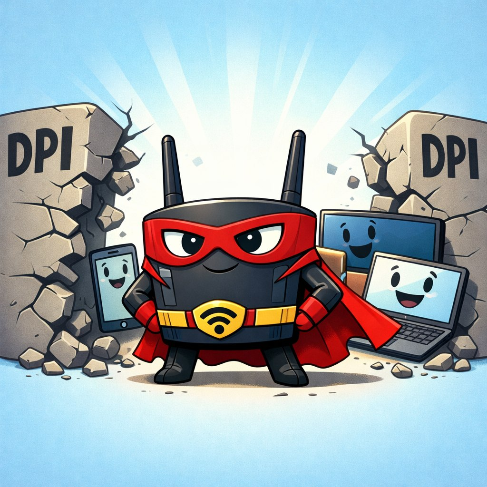
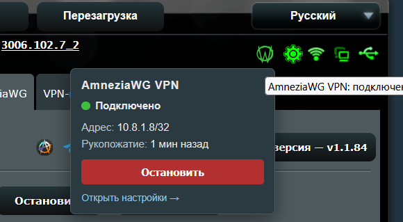
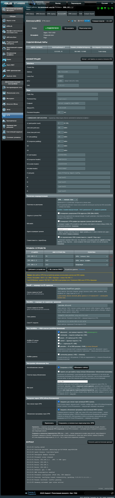
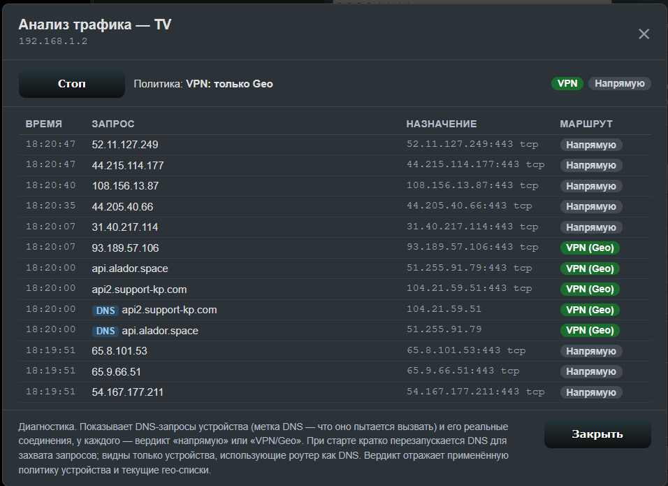
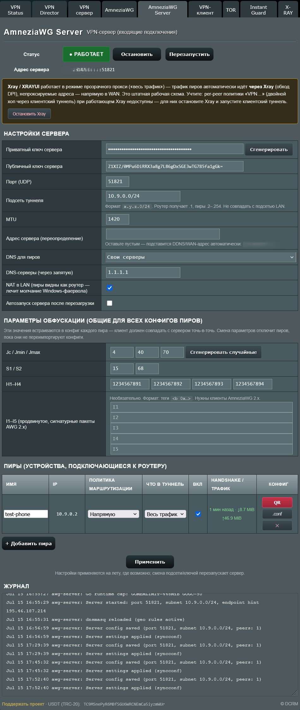

# AmneziaWG for Asuswrt-Merlin




[[русский]](README.md) [[english]](README_EN.md)

💬 Discussion & help — [community Telegram chat](https://t.me/asusxray/26094)

A DPI-bypassing VPN **client and server** based on [AmneziaWG](https://github.com/amnezia-vpn/amneziawg-go) with a web UI for ASUS routers running [Asuswrt-Merlin](https://www.asuswrt-merlin.net/) firmware. Client — per-device policy routing and selective GeoIP/GeoSite routing. Server — inbound connections to your home from anywhere in the world via a QR code, with the same obfuscation. Both roles run simultaneously.

Fully userspace implementation -- no kernel module required, works on any kernel version.

> **About:** originally a fork of [r0otx/asuswrt-merlin-amneziawg](https://github.com/r0otx/asuswrt-merlin-amneziawg), but the project has changed substantially since forking and is now maintained independently. Thanks to r0otx for the excellent foundation.

<details>
    <summary>Supported devices</summary>

All aarch64 (ARM64) routers running Asuswrt-Merlin (`384.15` or later, `3006.x`) with Entware installed:

- GT-AX11000
- GT-AXE11000
- GT-AX6000
- RT-AX86U
- RT-AX86U Pro
- RT-AX88U
- RT-AX88U Pro
- RT-AX58U
- RT-AX56U
- TUF-AX5400

Other aarch64 Merlin routers should also work.

</details>



<details>
<summary>Admin page screenshot</summary>



</details>

<details>
<summary>Traffic Analyzer screenshot</summary>



</details>

<details>
<summary>Server admin page screenshot</summary>



</details>

## Changelog

See [CHANGELOG.md](CHANGELOG.md) for the full changelog (in Russian).

## Features

- **AmneziaWG protocol** -- WireGuard with DPI obfuscation (Jc, Jmin, Jmax, S1-S4, H1-H4, long I1-I5 from AWG 2.x)
- **Userspace daemon** -- based on [amneziawg-go](https://github.com/amnezia-vpn/amneziawg-go), no kernel module; runs even on old ARM32 routers with 2.6.x kernels (RT-AC68U) — a dedicated legacy daemon build ships for them
- **Web UI** -- ROG-styled addon page (VPN > AmneziaWG), **bilingual RU/EN** (follows the firmware language), plus a **status widget in the header** of every router page with quick tunnel start/stop
- **Config import** -- upload a `.conf` file exported from the Amnezia VPN client
- **Per-device routing** -- a policy per device: `VPN: all traffic`, any geo policy, `Direct`
- **Server mode** -- the router accepts inbound AmneziaWG connections: reach your home network and the internet through your home from a phone/laptop anywhere, fully obfuscated (works where plain WireGuard is DPI-blocked). A dedicated **VPN > AmneziaWG Server** page: peer management, key + **QR generation right in the browser**, per-peer routing policy (including the **double hop** — peer traffic exits through the client tunnel), smart coexistence with Xray/XRAYUI. Client and server run simultaneously (see [Server mode](#server-mode--inbound-connections-v130))
- **Multiple geo policies** -- independent geo policies as tabs (up to 8); each with its own GeoIP / GeoSite / GeoCustom / Antifilter set, chosen per device. Identical lists download once into a shared pool
- **Policy mode** -- *include* (only the lists go via VPN) or *exclude* (everything goes via VPN **except** the lists)
- **Pointwise exclusions** -- own domains/IPs/files/URLs carved out of a policy (or, in exclude mode, carved back in)
- **GeoIP service routing** -- IP ranges for Telegram, Google, Netflix, Twitter, etc. via [Loyalsoldier/geoip](https://github.com/Loyalsoldier/geoip)
- **GeoSite domain routing** -- domain lists via [v2fly/domain-list-community](https://github.com/v2fly/domain-list-community) + dnsmasq ipset
- **Geo Antifilter** -- ready-made lists of resources blocked in Russia via [antifilter.download](https://antifilter.download/)
- **GeoCustom — own entries** -- manual domains, CIDR subnets, own files and URL sources
- **Traffic analyzer** -- per device, see which domains/connections go via VPN vs direct; add captured items to a chosen geo policy in one click
- **DNS interception** -- forces DNS through dnsmasq, blocks DoH/DoT for reliable geo routing
- **DNS via tunnel** -- optionally the whole LAN resolves through the config's DNS servers inside the tunnel (provider-internal resolvers like `100.64.0.1` work too); ISP DNS poisoning is out of the picture, and the firmware DNS returns automatically when the tunnel goes down
- **Kill switch** -- optional fail-closed mode: if the tunnel dies unexpectedly (daemon crash), traffic of VPN-policied devices is blocked instead of leaking to the WAN in the clear
- **Compatibility mode** -- peaceful coexistence with co-resident DPI tools (zapret/zapret2, xray/XRAYUI, b4): auto-detection, operation without the `:53` intercept, a dedicated routing table that never collides with theirs
- **Self-healing** -- a post-start health check (ping/TCP/handshake through the tunnel) with auto-rollback of a dead tunnel, a 5-minute watchdog (revives a fallen tunnel, repairs rules after firewall restarts), and a deadman guard against losing the LAN
- **Conflict warnings** -- on-page banners: co-resident DPI/proxy tools (zapret/b4), Xray/XRAYUI (a two-mode banner with a "Stop Xray" button + a peer-subnet coverage guard), the firmware's own VPN client (wgc/VPN Fusion), hardware CTF acceleration on old Broadcom (one-click "disable & reboot"), a private/CGNAT WAN address and a busy port for the server, domain Geo without DNS interception, a foreign match-all dnsmasq rule
- **In-app updates** -- one-click check & install of new versions (via jsDelivr when GitHub is blocked), installing a specific version (rollback) and manual `.ipk` upload right from the page; the changelog is shown before updating
- **Diagnostics** -- a page button collects a full report for troubleshooting (platform, binaries, routing, rules, dnsmasq, geo, logs) with keys automatically redacted
- **MSS clamping** -- automatic TCP MSS fix for tunnel traffic
- **Auto-update** -- daily cron for geo list refresh

## Requirements

- [Asuswrt-Merlin firmware](https://www.asuswrt-merlin.net/download) (`384.15` or later, `3006.x`)
- [Entware](https://github.com/Entware/Entware/wiki/Install-on-Asus-stock-firmware) installed (use [amtm](https://diversion.ch/amtm.html) to install)
- SSH access to the router
- For **client mode**: an AmneziaWG server to connect to — a VPN provider config or self-hosted (one-command install: [amneziawg-installer](https://github.com/bivlked/amneziawg-installer))
- For **server mode**: a public (white) IP on the WAN — or a UDP port forward on the upstream router (inbound connections won't reach you behind CGNAT; the page warns about it)

## Installation

### Quick install (one command)

```shell
curl -sfL https://raw.githubusercontent.com/william-aqn/asuswrt-merlin-amneziawg/main/install-online.sh | sh
```

The script auto-detects the router architecture, downloads the matching package from the latest release and installs it.

**If GitHub is blocked:** install via the jsDelivr mirror —

```shell
curl -sfL https://cdn.jsdelivr.net/gh/william-aqn/asuswrt-merlin-amneziawg@main/install-online.sh | sh
```

The script downloads the `.ipk` through mirror proxies. The SHA256 checksum is verified whenever the GitHub API is reachable; with GitHub fully blocked the check is skipped (jsDelivr serves only repository files and cannot attest release-asset hashes).

### From an .ipk package

Copy the package to the router and install:

```shell
scp amneziawg_1.0.0-1_aarch64-3.10.ipk admin@<router-ip>:/tmp/
```

```shell
ssh admin@<router-ip>
opkg install /tmp/amneziawg_1.0.0-1_aarch64-3.10.ipk
```

### Manual install

The project is fully **userspace**: the `amneziawg-go` daemon + the `awg` tool, no custom kernel module (only the stock `tun` is needed). For a clean install the easiest path is to build the `.ipk` (`./build-ipk.sh`) and install it via `opkg` (see "From an .ipk package") — the package lays out the binaries in `/opt/amneziawg`, the addon in `/jffs/addons/amneziawg`, creates the `S99amneziawg` init script and registers the pages.

To quickly update **only the addon** (backend scripts and web pages) without rebuilding binaries — copy the files straight into `/jffs/addons/amneziawg/` and restart:

```shell
scp addon/amneziawg.sh addon/amneziawg_page.asp addon/amneziawg_widget.js \
    addon/amneziawg_server.sh addon/amneziawg_server_page.asp addon/awg_qr.js \
    admin@<router-ip>:/jffs/addons/amneziawg/
ssh admin@<router-ip>
/jffs/addons/amneziawg/amneziawg.sh install_page    # re-register the pages in the router menu
/jffs/addons/amneziawg/amneziawg.sh restart          # restart the client tunnel with the new code
/jffs/addons/amneziawg/amneziawg_server.sh restart   # (if the server is running) restart it too
```

> GUI SCP clients: [WinSCP](https://winscp.net/eng/download.php) for Windows, [MacSCP](https://www.macscp.co/) for macOS.

### After installation

1. Log out and back into the router web UI
2. **Client** (internet through an external VPN): **VPN > AmneziaWG** → **Import Config** → upload the `.conf` from the Amnezia VPN client → **Apply**
3. **Server** (inbound connections to your home): **VPN > AmneziaWG Server** → **Generate** the keys → add a peer → **Apply** → **Start server** → scan the QR with the AmneziaWG app

The roles are independent: use either one alone or both at once.

## Usage

### Quick start (client)

1. Export a config from the Amnezia VPN client (a `.conf` file)
2. In the router UI: **VPN > AmneziaWG > Import Config** -- upload the file
3. Click **Apply** -- the tunnel starts automatically
4. Add devices under **Device Rules** with the policy you want

Inbound connections (reaching your home from your own devices) are configured separately — see [Server mode](#server-mode--inbound-connections-v130).

### Routing policies

In Device Rules every device gets a policy:

| Policy | Description |
|--------|-------------|
| **VPN: all traffic** | All the device's traffic goes via VPN |
| **VPN: \<geo policy name\>** | Routing by the chosen geo policy (see below). There are as many of these entries as geo policies you created |
| **Direct** | The device bypasses the VPN |

### Geo policies (tabs)

There can be several geo policies (up to 8) — they live in **tabs** (the "+ Add geo policy" button). Each tab has its own independent source set: **GeoIP**, **GeoSite**, **GeoCustom** (own domains/IPs/files/URLs) and **Geo Antifilter**. Which device uses which policy is chosen in Device Rules.

All policies feed **one** tunnel — only *which* destinations enter it differs (each policy has its own `ipset`). Identical lists across policies are downloaded and stored **once** (a shared pool); each policy's tunnel gets only what that policy selected. On low-memory routers the total `ipset` budget is split between policies so memory can't be exhausted.

**Policy mode** — a switch at the top of the tab:

| Mode | Behavior |
|------|----------|
| **VPN by lists** (include) | Only matches from the lists go into the tunnel; the rest goes direct |
| **Direct by lists** (exclude) | The other way around: all the device's traffic goes into the tunnel, **except** what's in the lists |

> Exclude mode pulls nearly all traffic into the tunnel (like "all traffic", with carve-outs) — keep that in mind when coexisting with zapret/Xray/b4.

**Pointwise exclusions** — a block at the end of the tab (own domains/IPs/subnets/files/URLs). Its entries behave as exceptions respecting the mode: in include mode they go **direct** (carved out of the VPN), in exclude mode — **into the VPN**. Handy when a large list (e.g. a GeoSite category) drags in too much.

### GeoIP Service Lists

Enter comma-separated service names to route their IP ranges via VPN:

```
telegram,google,facebook,twitter,netflix,cloudflare
```

These work by IP -- independent of DNS, ideal for Telegram and other apps that connect directly by IP.

### GeoSite Service Lists

Enter service names for domain-based routing via dnsmasq:

```
youtube,google,discord,netflix,spotify,instagram
```

Requires devices to use the router as their DNS server. For iPhone: **Settings > Wi-Fi > (i) > DNS > Manual > router IP only**.

### Geo Antifilter

Ready-made lists of resources blocked in Russia from [antifilter.download](https://antifilter.download/). Tick the ones you need — the IP lists are loaded into this geo policy's ipset (alongside GeoIP) and routed via VPN:

- **allyouneed** (~15K) -- all the needed subnets (= `ipsum` + `subnet`); the recommended pick
- **community** (~900) -- community-maintained subnets
- **ipsum** / **subnet** / **ip** (~48K) -- alternative slices, heavily overlapping with `allyouneed`
- **ipresolve** (~154K) -- IPs from DNS resolution; a very large list
- **community domains** (~485) -- a small domain list → dnsmasq

The full `domains.lst` (1.4M domains / 27 MB) is deliberately not offered — it is too large for dnsmasq on a router. These update with the same **Update Now** button and the same auto-update as the other geo lists.

### GeoCustom — own entries

- **Own domains** -- domains comma- or newline-separated (e.g. `example.com,service.org`)
- **Own IPs / subnets** -- IP/CIDR comma-separated (e.g. `8.8.8.8,1.1.1.0/24`)
- **Own files** -- named lists you can paste/edit right in the UI or upload from a file (domain → DNS, IP/subnet → ipset; `#` lines are comments)
- **URL sources** -- links to downloadable lists of the same format

The same fields exist in the **"Pointwise exclusions"** block — but there they act as exceptions (see [Geo policies](#geo-policies-tabs)).

### Server mode — inbound connections (v1.3.0)

The router can act not only as a client but also as an **AmneziaWG server**: a device (phone, laptop, another router) connects to your home from anywhere — gets access to the home network (NAS, cameras, RDP) and, optionally, reaches the internet through your home. All with AmneziaWG obfuscation, so it gets through where plain WireGuard is DPI-blocked. Target clients — the official **AmneziaWG 2.x** apps (Android/iOS/Windows/macOS).

A dedicated **VPN > AmneziaWG Server** page (the client part is untouched; both roles can stay enabled at the same time):

- **Setup** — **Generate** the server key pair, port (default `51821`, so it doesn't collide with the firmware's built-in WG server), tunnel subnet (default `10.9.0.0/24`), MTU. Obfuscation parameters (`Jc/Jmin/Jmax/S1/S2/H1-H4`, a "Generate random" button) + advanced `I1-I5` for AWG 2.x.
- **Peers** — a device table: name, auto-assigned IP, on/off, **routing policy** (`Direct` / `VPN: all traffic` / any geo policy), **tunnel scope** (all traffic or home network only). Key pairs and PSKs are generated **right in the browser** (Curve25519) — peer private keys never reach the backend.
- **Config hand-out** — per peer: a **QR code** (own generator, no external CDNs; scanned by the AmneziaWG app), `.conf` download, copy to clipboard.
- **Per-peer policy (double hop)** — a peer can get the same policy as a LAN device: with `VPN: all traffic` the peer's traffic exits through the **client** tunnel (phone → home → external VPN). Runs on top of the same policy engine. The rules live and die with the client tunnel's firewall: while the client tunnel is down, peer traffic goes straight to the WAN (fail-open; a yellow banner warns about it).
- **DNS for peers** — the router's dnsmasq by default (home device names and domain Geo work), or custom servers.
- **NAT to LAN** (on by default) — peers appear to LAN machines as the router itself, which cures the Windows firewall's silence toward a "foreign subnet".
- **Warnings** — banners for a private/CGNAT WAN address (the server won't take inbound connections — you need a public IP or a port forward), for a port collision with the firmware's built-in WG server, and about Xray/XRAYUI coexistence (see below).

**Coexistence with Xray / XRAYUI** (verified on a live router running both):

- **XRAYUI in "redirect all" mode + peers on "Direct" is a valid working setup.** XRAYUI picks up the peer subnet by itself (adds the same TPROXY rules for it as for the LAN), so peer traffic automatically flows **through Xray** (DPI bypass), and non-proxied destinations go straight to the WAN. The page shows a yellow info banner.
- **The double hop is unavailable while Xray runs**: Xray grabs traffic ahead of AmneziaWG's rules (ip-rule 19 vs 99) and chokes the client tunnel. If peers carry VPN policies while Xray is active — a red banner lists the two working setups: keep Xray and switch the peers to "Direct", or stop Xray (button in the banner), set the peer to "VPN: all traffic" and start the client tunnel.
- **Coverage guard**: if Xray is running but its capture rules do not include the peer subnet (usually XRAYUI started before this server did) — peer traffic bypasses Xray straight to the WAN, with no DPI bypass. The addon notices (log + yellow banner) and names the fix: restart XRAYUI (it picks up existing interfaces at start) or add the subnet to its settings.

CLI: `/opt/etc/init.d/S99amneziawg server {start|stop|status|restart|diag}`. Autostart after reboot is a **separate toggle, off by default** (a server that opens a WAN port must never come up on its own).

## Building from source

### Prerequisites

- Docker Desktop
- Go (a recent stable; the `armv7-2.6` package additionally needs the Go 1.23 toolchain — see below)
- GNU tar (`brew install gnu-tar` on macOS)

### Building amneziawg-go (the userspace daemon)

> **The daemon is built from our fork [`william-aqn/amneziawg-go`](https://github.com/william-aqn/amneziawg-go), not from upstream.** The reason is two router-critical fixes not yet accepted upstream (while the PRs are pending, the build comes from the fork):
> - **[PR #152](https://github.com/amnezia-vpn/amneziawg-go/pull/152)** — a bounded buffer pool (`PreallocatedBuffersPerPool`): the cure for `runtime: out of memory` under load on low-memory routers;
> - **[PR #153](https://github.com/amnezia-vpn/amneziawg-go/pull/153)** — a `sendmmsg`/`recvmmsg` → per-packet `sendmsg`/`recvmsg` fallback on `ENOSYS`: without it, on Linux kernels < 3.0 (RT-AC68U / 2.6.36) the daemon cannot send a single packet and the tunnel passes no traffic.
>
> The fork branch **`router-build`** = the `v0.2.19` tag (same AmneziaWG 1.5/2.0 parameters) + both patches as separate commits. **Once both PRs are merged upstream**, the build returns to `amnezia-vpn/amneziawg-go` — a two-line change (`AWG_GO_REPO`/`AWG_GO_REF`) in `.github/workflows/release.yml`.

```shell
git clone --depth 1 --branch router-build https://github.com/william-aqn/amneziawg-go.git
cd amneziawg-go

# ARM64 (aarch64-3.10) — GT-AX11000, RT-AX86U, RT-AX88U
CGO_ENABLED=0 GOOS=linux GOARCH=arm64 go build -ldflags="-s -w" -o ../output/amneziawg-go

# ARM32 (armv7-3.2) — RT-AX56U, RT-AX58U, newer HND routers
CGO_ENABLED=0 GOOS=linux GOARCH=arm GOARM=7 go build -ldflags="-s -w" -o ../output/amneziawg-go-arm
```

**ARM32 `armv7-2.6` (RT-AC68U, RT-AC66U and other 2.6.36-kernel routers) is built differently.** Go ≥ 1.24 supports only Linux kernels ≥ 3.2 — a regular build dies silently right after start on such a router. So the daemon for this package is built with the **Go 1.23** toolchain (supports kernels since 2.6.32), with dependencies rolled back to 1.23-compatible versions:

```shell
go get golang.org/x/sys@v0.35.0 golang.org/x/net@v0.43.0 golang.org/x/crypto@v0.41.0
go mod edit -go=1.23.0 -toolchain=none
GOTOOLCHAIN=go1.23.12 CGO_ENABLED=0 GOOS=linux GOARCH=arm GOARM=5 \
  go build -ldflags="-s -w" -o ../output/amneziawg-go-arm5
```

The canonical commands (including the version patch so `--version` reports `v0.2.19-legacy26-pool1024-smfix`, and the hard asserts that both patches are present) live in `.github/workflows/release.yml`, step "Build amneziawg-go-arm5 (legacy Go 1.23…)".

### Building the awg CLI (static musl)

The `awg` tool is statically linked with musl (so it runs on the router's old glibc). The canonical commands for all variants are in `.github/workflows/release.yml` (the "Build awg…" steps); CI builds `awg`/`awg-arm`/`awg-arm5` and publishes the `.ipk`s. Locally for ARM64:

```shell
docker run --rm --platform linux/arm64 -v "$PWD/output:/out" alpine:3.19 sh -c \
  'apk add --no-cache build-base linux-headers git && \
   git clone --depth 1 --branch v1.0.20260223 https://github.com/amnezia-vpn/amneziawg-tools.git /t && \
   cd /t/src && make LDFLAGS=-static PLATFORM_CFLAGS= && cp awg /out/awg'
```

> ARM32: `armv7` — same with `--platform linux/arm/v7`; the old `armv5` (RT-AC68U) **must** be soft-float (`dockcross/linux-armv5-musl`), otherwise SIGILL on VFP-less cores. Exact commands are in `release.yml`.

### Building the .ipk packages

```shell
./build-ipk.sh
```

Output:
- `output/amneziawg_*_aarch64-3.10.ipk` -- ARM64 routers (GT-AX11000, RT-AX86U, RT-AX88U)
- `output/amneziawg_*_armv7-2.6.ipk` -- old ARM32 routers (RT-AC68U, RT-AC66U)
- `output/amneziawg_*_armv7-3.2.ipk` -- newer ARM32 HND routers (RT-AX56U, RT-AX58U)

## CLI management

```shell
# Start/stop/restart
/opt/etc/init.d/S99amneziawg start
/opt/etc/init.d/S99amneziawg stop
/opt/etc/init.d/S99amneziawg restart

# Update to the latest version
/opt/etc/init.d/S99amneziawg update

# Install a specific version (e.g. rollback or a fix)
/opt/etc/init.d/S99amneziawg update 1.1.50

# Tunnel status (the client awg0 and/or the server awgs0)
awg show

# Server (inbound connections): start/stop/status/diagnostics
/opt/etc/init.d/S99amneziawg server start
/opt/etc/init.d/S99amneziawg server stop
/opt/etc/init.d/S99amneziawg server diag

# Refresh geo lists
/jffs/addons/amneziawg/amneziawg.sh update_geo

# Diagnostics — a full report (version, platform, binaries + live probes, the daemon's
# exit code, coreutils self-test, network/TUN, routing, rule counters, lock and watchdog
# state, per-policy geo ipsets, dnsmasq, the firmware VPN client, system logs, the
# generated config with keys redacted) for filing an issue
/jffs/addons/amneziawg/amneziawg.sh diag
```

> `S99amneziawg start` is the boot path (the system calls the same thing at router startup): it honors the **"Autostart"** checkbox from the web UI and will not bring the tunnel up while the checkbox is off. Manual start bypassing the checkbox: `/jffs/addons/amneziawg/amneziawg.sh start`.

> In the web UI the same report is available via the **"Get diagnostic data"** button in the Log block — it can be **downloaded** as a `.txt` file or **copied** to the clipboard with the 📋 mini-button (wrapped in a code block, ready to paste into Telegram).

## Uninstall

```shell
/jffs/addons/amneziawg/amneziawg.sh uninstall
opkg remove amneziawg
```

## Architecture

**Client** (outbound tunnel):

```
Internet <-- awg0 (tunnel) <-- iptables mangle chain AWG <-- br0 (LAN devices)
                                          |
                            each geo policy's ipset: awg_dst, awg_dst2, …
                            (GeoIP/Antifilter CIDRs + DNS resolutions; a policy
                             with exclusions also owns its awg_dst<id>_x)
                                          |
                                  fwmark 0x100 -> routing table 300 -> awg0
```

**Server** (inbound connections; its own interface and daemon, the client part is untouched):

```
Phone/laptop (peer) --> WAN UDP:51821 --> awgs0 (server) --> br0 (home network)
                                             |               └ NAT to LAN (option)
                                             ├--> straight to WAN (policy "Direct")
                                             └--> into the client tunnel awg0 (double hop,
                                                  a "VPN" policy — the same policy engine)
```

| Component | Purpose |
|-----------|---------|
| **amneziawg-go** | Userspace WireGuard daemon with AmneziaWG extensions (the client tunnel `awg0`) |
| **awgs-go** | The same daemon under its own process name — the server tunnel `awgs0` (a hardlink, so the two roles' lifecycles never touch each other) |
| **awg** | CLI tool for managing the tunnels |
| **amneziawg.sh** | Client backend: lifecycle, firewall, routing, geo lists, DNS interception; the shared helper library for both roles |
| **amneziawg_server.sh** | Server backend: peers, inbound firewall, peer DNS, per-peer policy (reuses `amneziawg.sh` helpers) |
| **amneziawg_page.asp** | Client web UI (**VPN > AmneziaWG**) |
| **amneziawg_server_page.asp** | Server web UI (**VPN > AmneziaWG Server**) |
| **awg_qr.js** | QR code and Curve25519 key generation right in the browser (no external CDNs; peer private keys never leave the page) |
| **amneziawg_widget.js** | The global header widget: an ● AWG status indicator on every firmware page + a mini start/stop panel (served as `/www/user/awg_widget.js`, loaded via `menuTree.js`) |

## FAQ

**Q: Telegram doesn't work through the VPN?**

A: Add `telegram` to the GeoIP Service Lists. Telegram connects directly by IP -- domain lists are not enough.

**Q: Sites don't open on an iPhone with a geo policy?**

A: iPhones use encrypted DNS (DoH), which bypasses the router's dnsmasq. Set DNS manually: Settings > Wi-Fi > (i) > DNS > Manual > router IP only.

**Q: The tunnel works for ping, but sites don't open?**

A: Restart the tunnel with a pause: `/jffs/addons/amneziawg/amneziawg.sh stop; sleep 5; /jffs/addons/amneziawg/amneziawg.sh start`

**Q: How do I add my own service by IP?**

A: Add CIDR ranges to the "Own IPs / subnets" field (GeoCustom), e.g. `149.154.160.0/20,91.108.4.0/22` for Telegram.

**Q: Is ARM32 (RT-AC68U) supported?**

A: Yes, there is a dedicated ARM32 `.ipk` (`armv7-2.6`). Since **1.2.32** the daemon in this package is built with a special legacy toolchain (Go 1.23) — regular Go ≥ 1.24 builds don't support these routers' 2.6.36 kernel and died silently with `ERROR: amneziawg-go failed to create interface`. To check you have the right build: `/opt/amneziawg/amneziawg-go --version` must report `v0.2.19-legacy26-pool1024-smfix (…)` (the daemon is built from [the fork](https://github.com/william-aqn/amneziawg-go) with two fixes — see "Building amneziawg-go"; the `-smfix` suffix = the `sendmmsg` fix, without which a 2.6.36 tunnel passes no traffic).

**Q: The tunnel stops by itself a minute or two after starting (or "runs 2 minutes → drop → reconnect")?**

A: Update to **1.2.32+**. Previously the health check and the watchdog probed the tunnel with ping (and TCP) against the hosts from `awg_watchdog_hosts` — and if those hosts answer neither ICMP nor TCP:443 (Cloudflare WARP, provider-internal gateways like `100.64.0.1`), a perfectly working tunnel was falsely declared dead and rolled back. Now the **WireGuard handshake itself** counts as proof of life (our own probe packets force it to refresh), so "silent" hosts no longer cause rollbacks. Still, leave the "probe hosts" field empty (defaults `8.8.8.8 1.1.1.1`) or point it at genuinely pingable addresses — the check completes faster with them.

**Q: How do I temporarily disable the tunnel so it doesn't come back after a reboot (without uninstalling)?**

A: Since **1.2.52** — properly: stop the tunnel with the "Stop" button and untick **"Autostart"** in the settings (Apply). After a reboot the tunnel stays stopped with the whole config intact; when needed again — "Start", and re-tick if you like. Handy while debugging co-resident tools (zapret2, Xray, etc.).

**Q: Can it run alongside zapret2 or Xray (XRAYUI)?**

A: Yes, with caveats. The addon auto-detects co-resident DPI bypasses/proxies (zapret2/bol-van, Xray/XRAYUI, v2ray, sing-box, **b4**, plus NFQUEUE/TPROXY rules in iptables or nftables) and in that case **does not enable DNS interception** (the :53 DNAT) to avoid clashing with them -- otherwise the network can end up without internet. This is governed by **"Compatibility mode"** (the former "Don't intercept DNS" checkbox): on a fresh install it is ON by default so even an undetected tool can't take the network down; upgraded installs keep their previous behavior until you switch it yourself.

Important: this only removes the DNS-level clash. With the default policy **"VPN -- all traffic"** the routing still steals traffic from the co-resident proxy, so for coexistence pick **"Direct"** or **"VPN -- Geo only"**, not "all traffic". Geo-by-IP keeps working either way.

**The reverse case — XRAYUI stealing AmneziaWG's traffic.** If XRAYUI runs in transparent-proxy "redirect all traffic" mode (TPROXY), it also captures the router's own egress — including AmneziaWG's handshake — so the tunnel comes up but passes no traffic (the health check rolls it back after ~60 s). The addon detects this and shows a **red banner** on the page. Fix: disable XRAYUI's "redirect all" / transparent routing, or exclude the endpoint and the `awg0` interface from its capture, or run only one VPN at a time.

**Q: What do I need for server mode (connecting to my home)?**

A: A public (white) IP on the WAN — or a forward of the addon's UDP port (51821 by default) on the upstream router. Behind CGNAT / a private address, inbound connections physically can't reach you — the server page warns with a red banner. The address for peer configs is filled in automatically (the firmware's DDNS, otherwise the current WAN IP); the client on the device is the official **AmneziaWG 2.x** app (it scans the QR from the page). Server autostart after reboot is a separate checkbox, off by default.

**Q: I connected to the router's server — the handshake is there, but a "VPN"-policied peer has no internet?**

A: Check the banners on the server page. Common causes: the client tunnel is not running (a peer's "VPN" policy is the double hop through it; while it's down, traffic goes direct — fail-open), or Xray/XRAYUI runs in "redirect all" mode — it is incompatible with the double hop (it grabs traffic ahead of the addon's rules and chokes the client tunnel). With Xray, keep peers on "Direct" — their traffic flows through Xray anyway (and the page will tell you if Xray hasn't picked up the peer subnet — fixed by restarting XRAYUI).

**Q: Is the addon compatible with QoS (Adaptive QoS / Cake / traditional)?**

A: Yes. Verified live on a GT-AX6000 with Adaptive QoS (Trend Micro): to QoS the whole tunnel is a single encrypted UDP flow from the router, classified and shaped as one unit (the bwdpi mark appears right on the tunnel's conntrack entry), and tunnel throughput didn't change with QoS on (22.7 → 22.2 MB/s — within noise). Toggling QoS restarts the firewall — the addon's rules are re-applied automatically (the firewall-start hook), the tunnel doesn't drop.

Honest limitations:
- **per-app and per-device QoS priorities don't apply to traffic inside the tunnel** — QoS can't see that it's YouTube from the TV in there; that's a property of any router VPN, not of the addon. Prioritizing/limiting the tunnel as a whole works; direct devices classify as usual;
- on weaker routers mind the combined CPU load: the QoS DPI engine + amneziawg-go's userspace crypto;
- an unlikely but possible packet-mark conflict mainly concerns **traditional QoS** (Adaptive on HND platforms marks at the kernel/conntrack level and doesn't sit in iptables ahead of our chain). The symptom is unambiguous: after enabling QoS, geo devices stop going through the tunnel — grab the diagnostics (it shows the AWG chain and counters) and write to the chat.

**Q: `ipset` prints `Warning: Kernel support protocol versions 6-6 while userspace supports protocol versions 6-7`?**

A: A harmless warning, not an error. The `ipset` tool (both the firmware's `/usr/sbin/ipset` and Entware's `/opt/sbin/ipset`) is built from newer sources and speaks protocol versions 6 and 7, while the ipset module in the router's old kernel (4.1.51) implements only version 6. The ranges overlap at version 6, so the tool automatically uses it -- everything works as intended. Nothing to do; geo routing via ipset (`awg_dst` and the geo ipsets) fully works on version 6.

## Authors

- **DCRM** -- maintainer and fork author, [github.com/william-aqn](https://github.com/william-aqn)
- **r0otx** -- author of the original project, [github.com/r0otx](https://github.com/r0otx)

## Support the project

If the project has been useful — you can support development:

**USDT (TRC-20):** `TC9MSnePyR6MBfSGU6WRCNEmCa5iyzmWUr`

## Acknowledgements

- [AmneziaWG](https://github.com/amnezia-vpn) -- the protocol and implementations
- [Loyalsoldier/geoip](https://github.com/Loyalsoldier/geoip) -- GeoIP CIDR service lists
- [v2fly/domain-list-community](https://github.com/v2fly/domain-list-community) -- domain lists
- [antifilter.download](https://antifilter.download/) -- RKN block lists (IPs/subnets and domains)
- [Asuswrt-Merlin](https://www.asuswrt-merlin.net/) -- the router firmware
- [DanielLavrushin/asuswrt-merlin-xrayui](https://github.com/DanielLavrushin/asuswrt-merlin-xrayui) -- routing architecture reference

## Disclaimer

This project is a technical tool for network security and privacy. Using a VPN is not prohibited in the Russian Federation (as of March 2026). The author bears no responsibility for using this software in ways that violate the laws of the Russian Federation or any other jurisdiction. Users are solely responsible for complying with applicable law.

## License

MIT License
